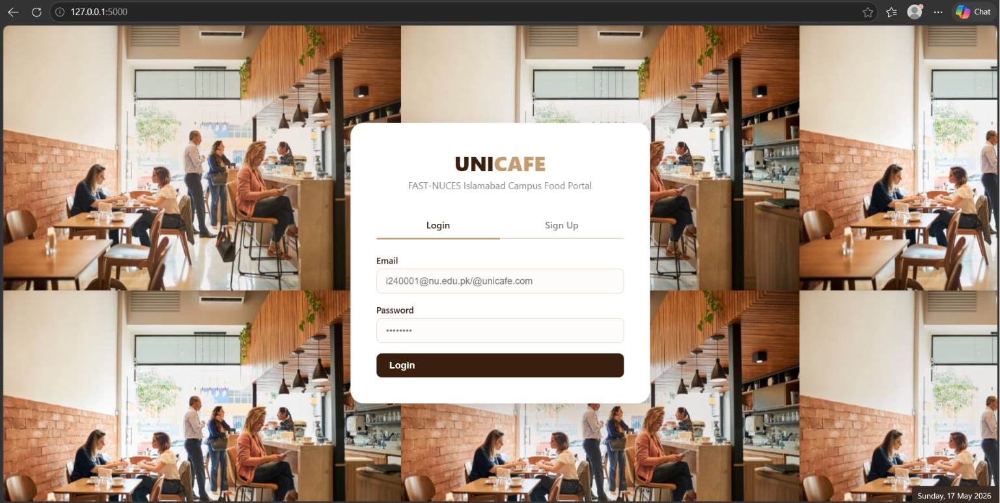
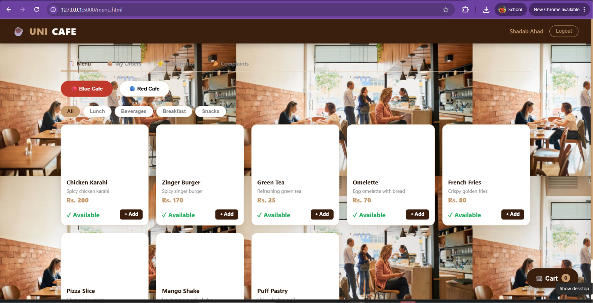
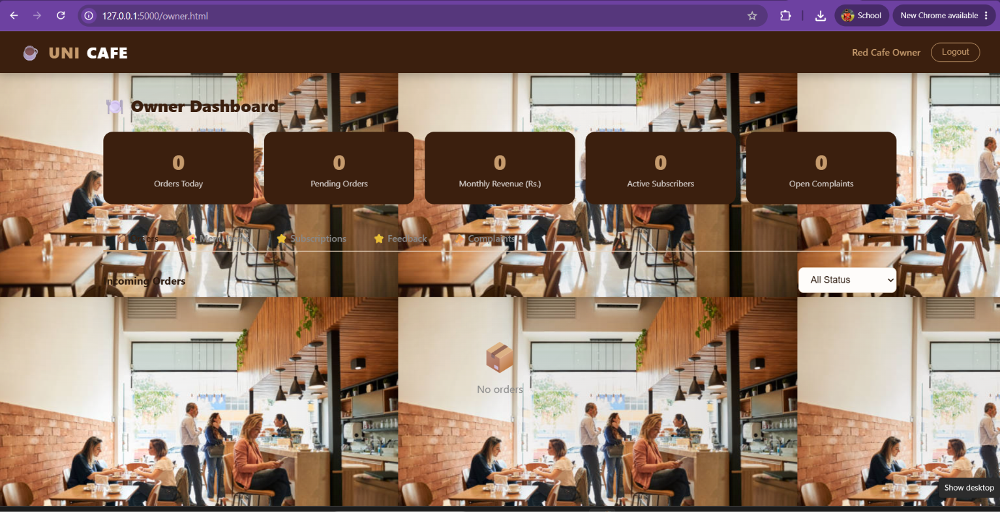

<div align="center">

# 🍔 UNICAFE
### Campus Food Delivery Portal

**FAST-NUCES Islamabad**

[](https://python.org)
[](https://flask.palletsprojects.com)
[](https://sqlite.org)
[](https://developer.mozilla.org/en-US/docs/Web/HTML)
[](https://developer.mozilla.org/en-US/docs/Web/CSS)
[](https://developer.mozilla.org/en-US/docs/Web/JavaScript)

*A full-stack web application for ordering food from campus cafes — built for students, by students.*

[Features](#-features) • [Quick Start](#-quick-start) • [Demo Accounts](#-demo-accounts) • [Tech Stack](#-tech-stack) • [Team](#-team)

</div>

---

## 📌 About

UNICAFE is a campus food ordering and delivery management system designed for **FAST-NUCES Islamabad**. It connects three types of users — **students**, **cafe owners**, and **delivery boys** — in one seamless platform.

Students can subscribe to cafes, browse menus, place orders, and track deliveries in real time. Owners manage their menus and incoming orders, while delivery boys handle assignments and track their earnings.

---

## ✨ Features

### 🎓 For Students
- Sign up and log in securely
- Request subscription to a cafe (owner approval required)
- Browse full cafe menus with categories and prices
- Add items to cart and place orders with room number delivery
- Track order status live (Pending → Preparing → Ready → Delivered)
- Rate orders and file complaints after delivery

### 🏪 For Cafe Owners
- Manage menu items — add, edit, delete, toggle availability
- View and process incoming orders step-by-step
- Approve/reject student subscription requests
- Assign delivery boys to ready orders
- View feedback and resolve complaints

### 🛵 For Delivery Boys
- Register under a specific cafe
- View assigned active orders
- Mark orders as delivered
- Track delivery history and earnings (Rs. 10/delivery)

---

## 🚀 Quick Start

### Prerequisites
- Python 3.8+
- pip

### Installation

```bash
# 1. Clone the repository
git clone https://github.com/YOUR_USERNAME/unicafe.git
cd unicafe

# 2. Install dependencies
pip install flask flask-cors bcrypt

# 3. Run the app
python app.py
```

Then open your browser and go to: **http://localhost:5000**

### Platform-Specific Launchers

**Windows:**
```
Double-click run.bat
```

**Linux / macOS:**
```bash
chmod +x run.sh
./run.sh
```

---

## 🔑 Demo Accounts

Use these to explore the system without signing up:

| Role | Email | Password |
|------|-------|----------|
| 🔴 Red Cafe Owner | redcafe@unicafe.com | redcafe123 |
| 🔵 Blue Cafe Owner | bluecafe@unicafe.com | bluecafe123 |

> Sign up as **Student** or **Delivery Boy** from the main signup page.

---

## 🗂️ Project Structure

```
unicafe/
├── app.py              ← Flask backend (all API routes & DB logic)
├── run.bat             ← Windows one-click launcher
├── run.sh              ← Linux/Mac one-click launcher
├── package.json        ← Project metadata
└── public/
    ├── index.html      ← Login & Signup page
    ├── menu.html       ← Student dashboard
    ├── owner.html      ← Cafe owner dashboard
    ├── delivery.html   ← Delivery boy dashboard
    ├── style.css       ← All shared styles
    └── utils.js        ← Shared JS utilities
```

---

## 🔄 How It Works

```
Student ──────► Subscribes to Cafe
                      │
              Owner Approves/Rejects
                      │
Student ──────► Browses Menu & Places Order
                      │
              Owner: Preparing → Ready → Assigns Delivery Boy
                      │
Delivery Boy ──────► Marks as Delivered
                      │
Student ──────► Rates & Reviews
```

---

## 🛠️ Tech Stack

| Layer | Technology |
|-------|-----------|
| Backend | Python, Flask |
| Database | SQLite3 |
| Auth | Server-side sessions + bcrypt |
| Frontend | HTML5, CSS3, Vanilla JS |
| API Style | RESTful JSON |

---

## 📸 Screenshots

| Login Page | Student Dashboard | Owner Panel |
|------------|------------------|-------------|
|  |  |  |

---

## 👥 Team

| Name | Role |
|------|------|
| **Maryam Abid** | Project Lead |
| **Aftab Ahmed** | Backend Developer |
| **Shadab Ahad** | Frontend Developer |

> 📍 FAST-NUCES Islamabad

---

## 📄 License

This project was built as an academic project. Feel free to use it for learning purposes.

---

<div align="center">

Made with ❤️ at FAST-NUCES Islamabad

</div>
